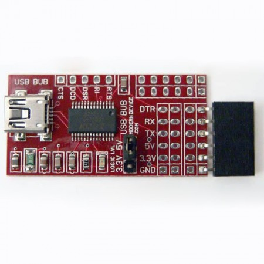

# USB BUB I

#### Product Description

This is the first revision of the BUB. 

#### USB to TTL serial adapter

The USB BUB board has been engineered to be an affordable, flexible USB connector with lots of applications. It uses the popular FT232R chip, the same as Arduinos, the FTDI cable we sell, and the Spark Fun breakout boards. This board also has a few features not found on some other USB boards.

* An inductor to filter some high frequency noise from the power line
* A polyfuse to protect the USB line from short circuits
* An LED which shows serial activity on both the TX and RX lines
* A shunt to switch the logic levels from 5 to 3.3 volts. This shunt doesn’t switch the power though, the 3.3 V pin from the FT232R is available but remember that it’s only good for 50 mA of current. Maybe a future version will feature a 3.3 V regulator too.
* If you leave the shunt off (because it sticks up say) the chip defaults to 3.3V logic levels, but these still seem to work fine on 5 volt Arduinos, BBBs etc.
Two sets of header sockets, both of which can be remapped by the user.

One pin header comes connected in the pin order of the FTDI RS232 cable (the same as the BBB/RBBB/LilyPad/Arduino Pro pin header, with the added bonus of having the DTR line instead of having to use the RTS line (with its attendant quirks), the way the FTDI cable works.

The other socket is unmapped and is available for the user to remap in any convenient manner, so you basically get two adapters for the price of one. Map one for 3.3V and the other for 5V projects. Remap one for a Basic Stamp, or breadboard Arduino or anything that comes up.

The main header can also be easily remapped should one wish, by cutting the traces and adding jumpers for the required pin order.

#### Optiboot

Customers using the Optiboot bootloader should solder up one of the Logic Level options (LGLV jumpers on the board).
The Arduino Deicimila / Duemilanove bootloader works fine with the logic level pin floating (VCCIO – pin 4 on the FTDI chip) but the Optiboot bootloader does not, probably because of the higher upload speed. The BUB seems to upload with Optiboot with either the 5V or 3.3V option soldered, but will  not upload to Optiboot with the
option floating (nothing soldered).

#### Package Contents

The USB-BUB is shipped with two female six-pin headers, one male three-pin header/shunt for the logic level select, that the user must solder on. All other parts are mounted and the board has been tested and is ready to go.

The USB BUB is available with or without a USB mini cable (1-foot or 3-foot). This is the same one that your digital camera connects with, so you can use the one you already have or get an extra for your camera. All for less than the price of competing adapters or the FTDI cable.

#### Resources

[Instructions and Schematic](./USB_BUB_instructions.02.pdf)