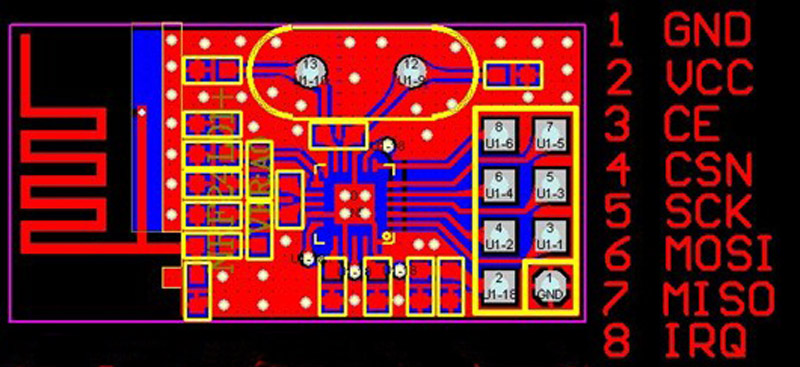

## nRF24L01 2.4GHz Radio/Wireless Transceivers How-To

*This is mostly just a local copy of the arduino-info article found here: [http://arduino-info.wikispaces.com/Nrf24L01-2.4GHz-HowTo](http://arduino-info.wikispaces.com/Nrf24L01-2.4GHz-HowTo)*

Having two or more Arduinos be able to communicate with each other wirelessly over a distance opens lots of possibilities:

* Remote sensors for temperature, pressure, alarms, much more
* Robot control and monitoring from 50 feet to 2000 feet distances
* Remote control and monitoring of nearby or neighborhood buildings
* Autonomous vehicles of all kinds

These are a series of 2.4 GHz Radio modules that are all based on the Nordic Semiconductor nRF24L01+ chip. [Details](http://www.nordicsemi.com/eng/Products/2.4GHz-RF/nRF24L01P) The Nordic nRF24L01+ integrates a complete 2.4GHz RF transceiver, RF synthesizer, and baseband logic including the Enhanced ShockBurst™ hardware protocol accelerator supporting a high-speed SPI interface for the application controller. The low-power short-range (200 feet or so)Transceiver is available on a board with Arduino interface and built-in Antenna for less than $3! [See it here](http://yourduino.com/sunshop2/index.php?l=product_detail&p=188).

* See: EXAMPLE SOFTWARE SKETCHES AT END OF PAGE:
* See: NEW EXAMPLE: Radio link transmitting Joystick positions to a receive unit controlling X,Y Servos that follow the remote Joystick. Uses the RadioHead Library.

### NOTE! Power Problems:
Many users have had trouble getting the nRF24L01 modules to work. Many times the problem is that the 3.3V Power to the module does not have enough current capability, or current surges cause problems. Here are suggestions:

* Connect a .3.3 uF to 10 uF (MicroFarad) capacitor directly on the module from +3.3V to Gnd (Watch + and - !) [Some users say 10 uF or more..]
* A separate 3.3V power supply
* A YourDuinoRobo1 Arduino compatible, which has an added 3.3V regulator (But maybe add a .1 uF capacitor on the radio module).

This is especially important if you are connecting the module with jumper wires.

If you design a printed circuit board that the module plugs into, add .1uf and 10uf capacitors close to the GND and 3.3V pins.
This is particularly noticeable when 3.3V power comes from a MEGA, Nano etc. that has only 50 ma of 3.3V power available. Newer boards like the YourDuinoRobo1 have 350 ma or more available and can run the high-power modules directly.

### Range??
Range is very dependent on the situation and is much more with clear line of sight outdoors than indoors with effects of walls and materials. The usual distance quoted by different suppliers for the low-power version module with the single chip is 200 Feet or 100 Meters. This is for open space between units operating at 250KHz. Indoors the range will be less due to walls etc...

We suggest you test two units at your actual locations before making a decision. There are units with an Antenna Preamplifier for the receiver and transmitter power amplifier and external antenna. The range between that type unit and several low-power units will be better than between two low-power units. Every situation is a little different and difficult to get an exact number without actual tests.

[Link to nRF24L01+ Data Sheet](http://www.nordicsemi.com/eng/content/download/2726/34069/file/nRF24L01P_Product_Specification_1_0.pdf). You don't have to, but if you want to understand more about what you can do with this "little" radio, download the data sheet. In particular you may want to read pages 7-8-9 ( For Overview and Features), and page 39 (MultiCeiver, which allows 6 Arduinos to talk to a Primary Arduino in an organized manner). Fortunately the board-level products we have take care of many of the physical and electrical details and Antenna Impedance Matching etc., and this library takes care of lots of register initialization and operational details.

There are additional modules which add Transmitter power amplifiers and Receiver preamplifiers for longer distances.. up to 1 Km (3000 feet). These modules use an external antenna which can be a simple directly-attached one or a cable-connected antenna with more gain or directivity. Here's what some of these look like:
 

On the top is the low-power version, with it's built-in zig-zag antenna. On the bottom you can see the pins sticking down (up in this photo) that connect to Arduino. Later we will show the pinout.

 
Above is the version with Transmit Power amplifier and Receive Preamplifier. Our low-cost antenna is on the unit shown on the bottom. The same 8 pins connect to Arduino and the same software is used.

Here's a [link to a Home-Brew antenna design](http://achuwilson.wordpress.com/2012/05/18/long-range-rf-link-using-nrf24l01-rf-transceiver/)

These transceivers use the 2.4 GHz unlicensed band like many WiFi routers, some cordless phones etc.

Transceivers like these both send and receive data in 'packets' of several bytes at a time. There is built-in error correction and resending, and it is possible to have one unit communicate with up to 6 other similar units at the same time.

These amazing low-cost units have a lot of internal complexity but some talented people have written Arduino libraries that make them easy to us. We have other pages that show examples and point to the free software libraries you may need. They all use the same pinout as shown in the following diagram, which is a TOP VIEW:

BOTTOM VIEW:

Here's details of the Pinout and connections to Arduino (updated):

* NOTE!! Most * problems with intermittent operation are because of electrical noise on the 3.3V Power supply. The MEGA is more of a problem with this. Solution: ADD bypass capacitors across GND and 3.3V ON the radio modules. One user said, "Just Solder a 100nF ceramic cap across the gnd and 3.3v pins direct on the nrf24l01+ modules!" Some have used a 1uF to 10uF capacitor.
* NOTE: Pin 8 IRQ is Unused by most software, but the RF24 library has an example that utilizes it.

The COLOR is for optional color-coded flat cable [such as THIS](http://yourduino.com/sunshop2/index.php?l=product_detail&p=185). We'll add some photos soon showing easiest ways to cable these...

**NOTE:** These units VCC connection **must go to 3.3V not 5.0V**, although the Arduino itself may run at 5.0V and the signals will be OK. The NRF24L01+ IC is a 3.3V device, but its I/O pins are 5 V tolerant , which makes it easier to interface to Arduino/YourDuino.

Arduino UNO and earlier versions have a 3.3V output that can run the low-power version of these modules (See Power Problems at the top of this page!), but the high-power versions must have a separate 3.3V supply. The YourDuinoRobo1 has a higher power 3.3V regulator and can be used to run the high-power Power Amplifier type module without a separate 3.3V regulator.

### nRF24L01 SOFTWARE AND LIBRARIES:

We will show an example of transmit and receive software below, and there are many examples on the RF24 Library download page. You will need a library of software to run the nRF24L01 radios. There are lots of details but you can ignore many of them that the library will take care of.

* Get Maniacbug's excellent RF24 Library:
Download it [HERE](https://github.com/maniacbug/RF24): (Click "Download ZIP" on the lower right of the page)
* Once you have downloaded the ZIP, you should see a folder called RF24-master.ZIP. Change the name of this file to just RF24.ZIP. Double click on the ZIP and you should see a non-ZIP folder also called 
RF24-master. Rename this to just RF24 as well.
* Then see our page about installing libraries [HERE](http://arduino-info.wikispaces.com/Arduino-Libraries):
* When you have the library installed, you can run the examples below.

#### More Information on these pages:

* [RF24 Library and Examples](http://arduino-info.wikispaces.com/nRF24L01-RF24-Examples): Many good details and more features like error correction and Networking.
* [RF24 Network System information](http://maniacbug.github.com/RF24Network/index.html): A many-node network under development
* [ManiacBug's Blog entry](http://maniacbug.wordpress.com/2012/03/30/rf24network/) and discussion of the Network

**RadioHead: A very full-featured Library with support for may different radios, not just nRF24L01**:
[http://www.airspayce.com/mikem/arduino/RadioHead/index.html](http://www.airspayce.com/mikem/arduino/RadioHead/index.html)

[Mirf Library Example](http://arduino-info.wikispaces.com/nRF24L01-Mirf-Examples): A simpler demonstration

### EXAMPLE ARDUINO SKETCHES:

**Example:** Transmit the position of a Joystick X and Y with one nRF24L01 to another nRF24L01 that will receive and display the Joystick position.

There are two sketches that you can cut and paste into a blank Arduino IDE windows and then save. Upload one to the Arduino that has an nRF24L01 connected, and the joystick or Potentiometers connected. Upload the other into an Arduino with an nRf24L01.

#### YD\_nRF24L01\_Transmit\_JoyStick

	/* YourDuinoStarter Example: nRF24L01 Transmit Joystick values
	 - WHAT IT DOES: Reads Analog values on A0, A1 and transmits
	   them over a nRF24L01 Radio Link to another transceiver.
	 - SEE the comments after "//" on each line below
	 - CONNECTIONS: nRF24L01 Modules See:
	 http://arduino-info.wikispaces.com/Nrf24L01-2.4GHz-HowTo
	   1 - GND
	   2 - VCC 3.3V !!! NOT 5V
	   3 - CE to Arduino pin 9
	   4 - CSN to Arduino pin 10
	   5 - SCK to Arduino pin 13
	   6 - MOSI to Arduino pin 11
	   7 - MISO to Arduino pin 12
	   8 - UNUSED
	   - 
	   Analog Joystick or two 10K potentiometers:
	   GND to Arduino GND
	   VCC to Arduino +5V
	   X Pot to Arduino A0
	   Y Pot to Arduino A1
	   
	 - V1.00 11/26/13
	   Based on examples at http://www.bajdi.com/
	   Questions: terry@yourduino.com */

	/*-----( Import needed libraries )-----*/
	#include <SPI.h>
	#include <nRF24L01.h>
	#include <RF24.h>
	/*-----( Declare Constants and Pin Numbers )-----*/
	#define CE_PIN   9
	#define CSN_PIN 10
	#define JOYSTICK_X A0
	#define JOYSTICK_Y A1

	// NOTE: the "LL" at the end of the constant is "LongLong" type
	const uint64_t pipe = 0xE8E8F0F0E1LL; // Define the transmit pipe

	/*-----( Declare objects )-----*/
	RF24 radio(CE_PIN, CSN_PIN); // Create a Radio
	/*-----( Declare Variables )-----*/
	int joystick[2];  // 2 element array holding Joystick readings

	void setup()   /****** SETUP: RUNS ONCE ******/
	{
	  Serial.begin(9600);
	  radio.begin();
	  radio.openWritingPipe(pipe);
	}//--(end setup )---

	void loop()   /****** LOOP: RUNS CONSTANTLY ******/
	{
	  joystick[0] = analogRead(JOYSTICK_X);
	  joystick[1] = analogRead(JOYSTICK_Y);
	  
	  radio.write( joystick, sizeof(joystick) );

	}//--(end main loop )---

	/*-----( Declare User-written Functions )-----*/

	//NONE
	//*********( THE END )***********

#### YD\_nRF24L01\_Receive\_JoyStick

	/* YourDuinoStarter Example: nRF24L01 Receive Joystick values

	 - WHAT IT DOES: Receives data from another transceiver with
	   2 Analog values from a Joystick or 2 Potentiometers
	   Displays received values on Serial Monitor
	 - SEE the comments after "//" on each line below
	 - CONNECTIONS: nRF24L01 Modules See:
	 http://arduino-info.wikispaces.com/Nrf24L01-2.4GHz-HowTo
	   1 - GND
	   2 - VCC 3.3V !!! NOT 5V
	   3 - CE to Arduino pin 9
	   4 - CSN to Arduino pin 10
	   5 - SCK to Arduino pin 13
	   6 - MOSI to Arduino pin 11
	   7 - MISO to Arduino pin 12
	   8 - UNUSED
	   
	 - V1.00 11/26/13
	   Based on examples at http://www.bajdi.com/
	   Questions: terry@yourduino.com */

	/*-----( Import needed libraries )-----*/
	#include <SPI.h>
	#include <nRF24L01.h>
	#include <RF24.h>
	/*-----( Declare Constants and Pin Numbers )-----*/
	#define CE_PIN   9
	#define CSN_PIN 10

	// NOTE: the "LL" at the end of the constant is "LongLong" type
	const uint64_t pipe = 0xE8E8F0F0E1LL; // Define the transmit pipe

	/*-----( Declare objects )-----*/
	RF24 radio(CE_PIN, CSN_PIN); // Create a Radio
	/*-----( Declare Variables )-----*/
	int joystick[2];  // 2 element array holding Joystick readings

	void setup()   /****** SETUP: RUNS ONCE ******/
	{
	  Serial.begin(9600);
	  delay(1000);
	  Serial.println("Nrf24L01 Receiver Starting");
	  radio.begin();
	  radio.openReadingPipe(1,pipe);
	  radio.startListening();;
	}//--(end setup )---

	void loop()   /****** LOOP: RUNS CONSTANTLY ******/
	{
	  if ( radio.available() )
	  {
		// Read the data payload until we've received everything
		bool done = false;
		while (!done)
		{
		  // Fetch the data payload
		  done = radio.read( joystick, sizeof(joystick) );
		  Serial.print("X = ");
		  Serial.print(joystick[0]);
		  Serial.print(" Y = ");      
		  Serial.println(joystick[1]);
		}
	  }
	  else
	  {    
		  Serial.println("No radio available");
	  }

	}//--(end main loop )---

	/*-----( Declare User-written Functions )-----*/

	//NONE
	//*********( THE END )***********

